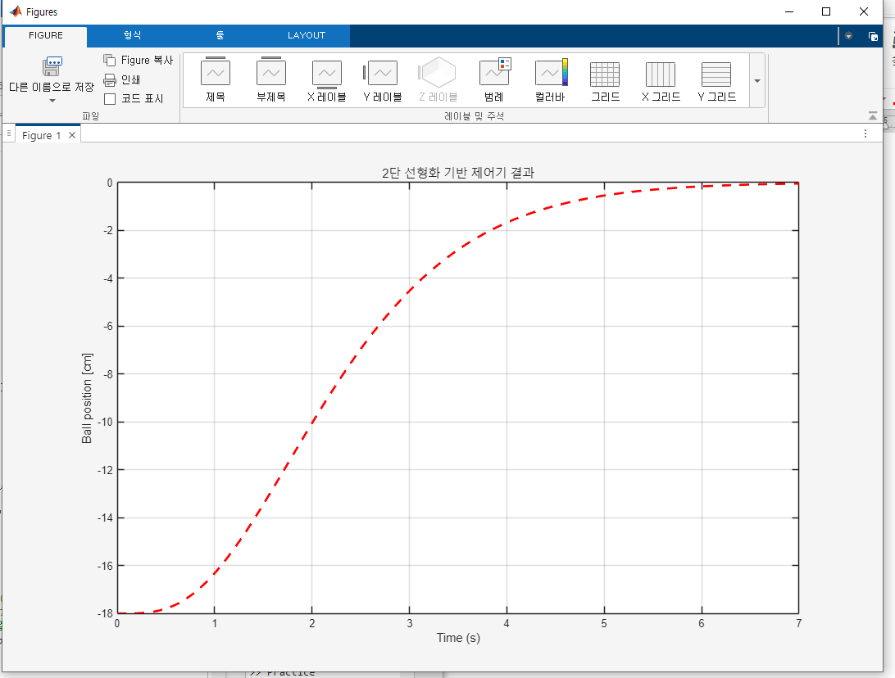
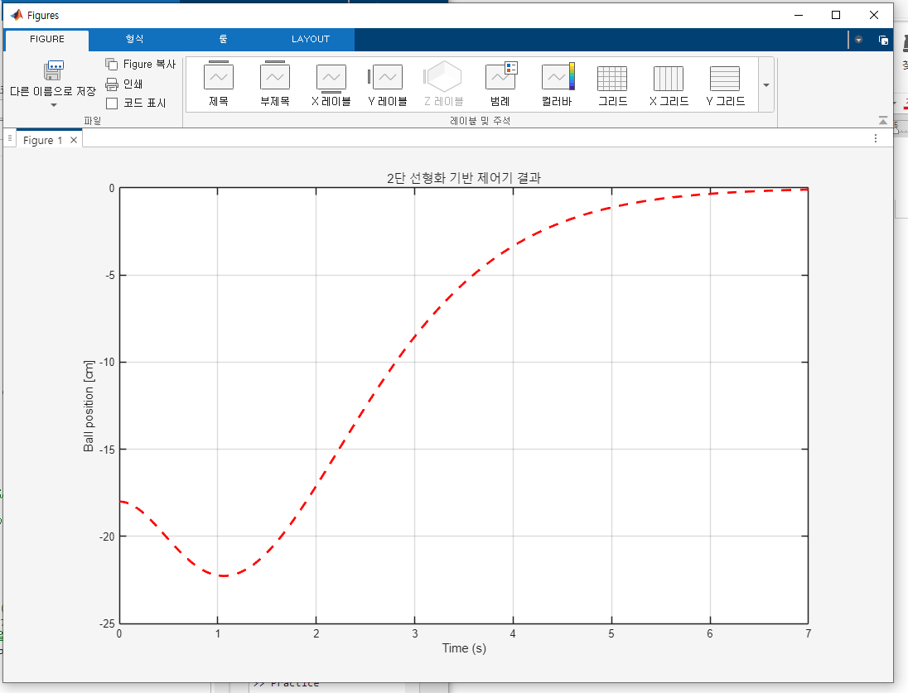

# BallBeam

BallBeam Matlab simulation

## Simulation Results

### 1. Two-stage Linearization (x₃ = 0)

### 2. Two-stage Linearization (Original Initial State)

### 3. Jacobian Linearization

### 4. Switching Control

## Reference

This simulation is based on the methods presented in the following paper:

**Kyung-Tae Lee, Ho-Lim Choi**,  
*"Switching Control of Ball and Beam System using Partial State Feedback: Jacobian and Two-Step Linearization Methods,"*  
**The Transactions of the Korean Institute of Electrical Engineers**, Vol. 66, No. 5, pp. 819–832, 2017.  
DOI: [10.5370/KIEE.2017.66.5.819](https://doi.org/10.5370/KIEE.2017.66.5.819)

Please cite the original paper if you use or build upon this code.
