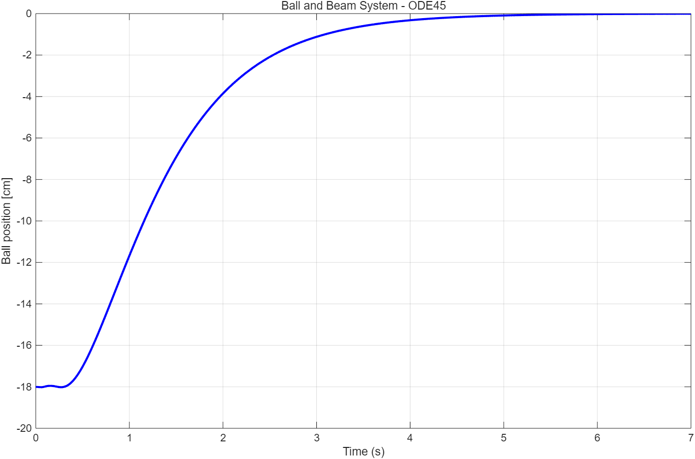
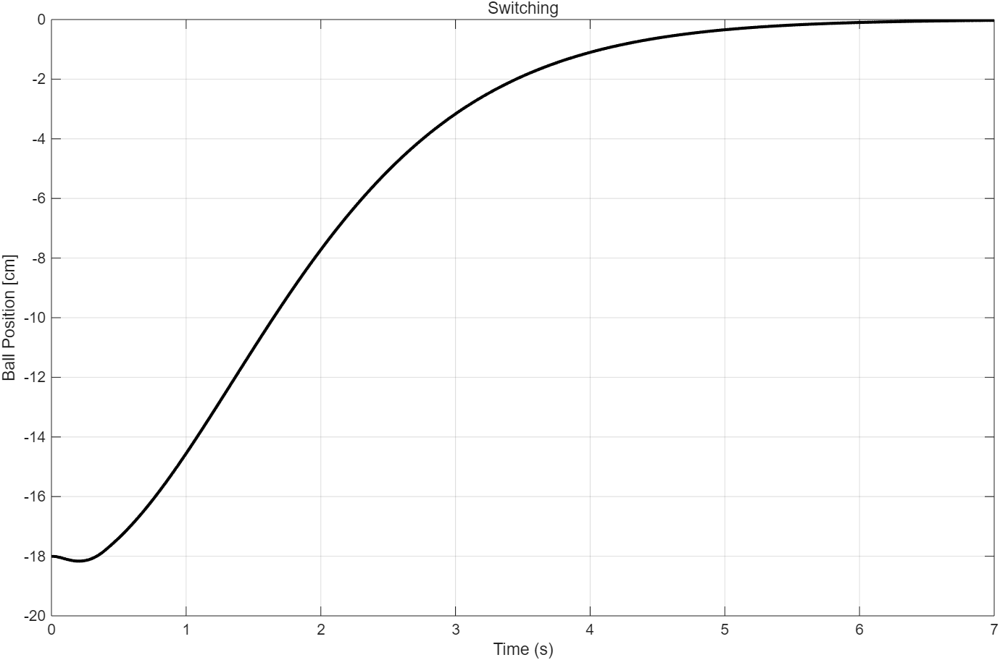

# BallBeam

BallBeam Matlab simulation

## Simulation Results

### 1. Two-stage Linearization (x₃ = 0)

### 2. Two-stage Linearization (Original Initial State)

### 3. Jacobian Linearization

### 4. Switching Control

